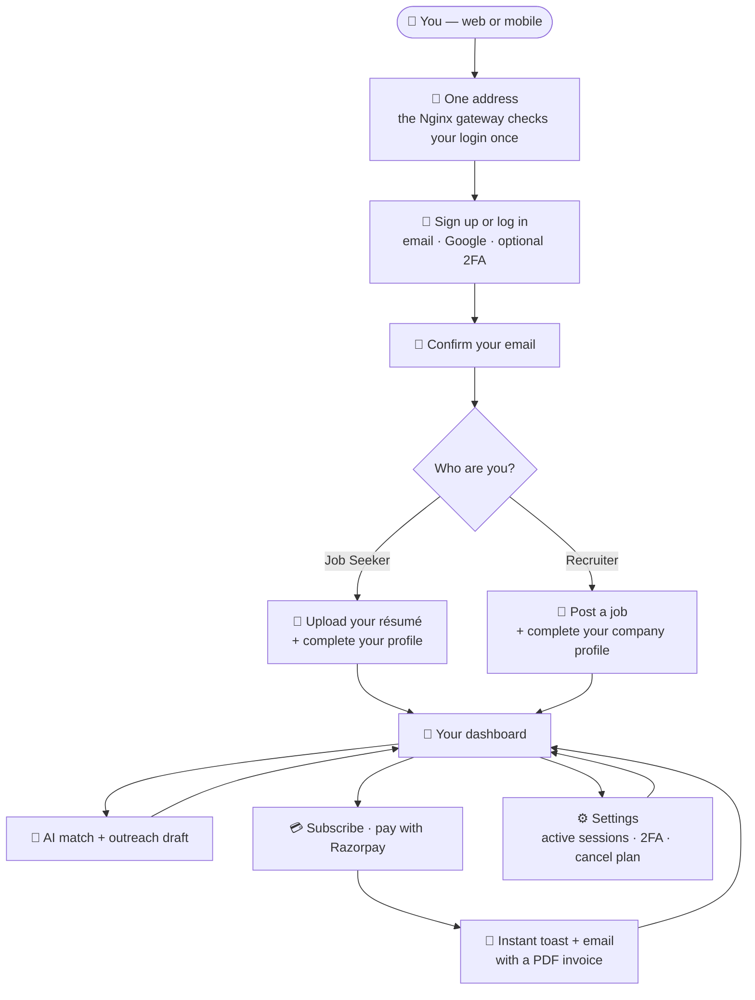
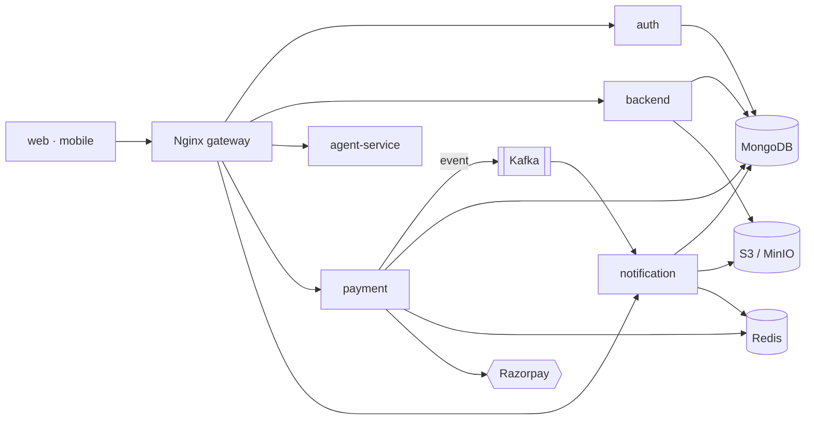

# 🔍 JobLensAI

JobLensAI is a job-matching platform for job seekers and recruiters, with an AI layer for resume and job matching. I built the whole thing solo — the seven services behind one gateway, the shared library, the React app, and all three ways of running it (Docker Compose, a local Kubernetes cluster, and AWS).

I didn't set out to make a toy. I wanted to find out whether one person could build something that actually holds up the way real production software does: services that scale independently, payments that don't double-charge, websockets that work behind a load balancer, secrets that don't live in `.env` files, and a deploy story that isn't "SSH in and `git pull`." This README walks through what's here and, more importantly, _why_ it's built this way.

> **Status, honestly:** auth, the core API, payments, notifications, and the web app are working end to end. `agent-service` and the Expo `mobile` app are scaffolded — dependencies and shells are in place, but the matching workflows and the mobile screens are still in progress. I'd rather tell you that than pretend otherwise.

---

## Contents

1. [The big picture](#the-big-picture)
2. [How services talk to each other](#how-services-talk-to-each-other)
3. [Repo layout](#repo-layout)
4. [The services](#the-services)
5. [Tech stack](#tech-stack)
6. [Two flows, traced end to end](#two-flows-traced-end-to-end)
7. [The problems I actually had to solve](#the-problems-i-actually-had-to-solve)
8. [Running it](#running-it)
9. [Infrastructure](#infrastructure)
10. [What I'd build next](#what-id-build-next)

---

## The big picture

Easiest way in is to follow a real person through it. You only ever talk to one address — the Nginx gateway. It checks who you are once, then hands the request to whichever service owns that job. You never see the services.



Each step in that picture is owned by exactly one service:

| What you're doing                        | Service         | Where it lands                        |
| ---------------------------------------- | --------------- | ------------------------------------- |
| Sign up, log in, 2FA, sessions           | `auth`          | `/api/auth/*`                         |
| Profile, résumé, job posts, file uploads | `backend`       | `/api/account/*`, `/api/file/*`       |
| Résumé-to-job matching, outreach drafts  | `agent-service` | `/api/agent/*` _(scaffolded)_         |
| Subscribe, cancel, Razorpay webhook      | `payment`       | `/api/payment/*`                      |
| Toasts, notification list, invoice email | `notification`  | `/api/notifications/*`, `/socket.io/` |

And under the hood, that's a pnpm monorepo: every backend service is a small Express + TypeScript app, the clients are a React SPA and an Expo app, and nothing is exposed directly.



Every service pulls in `@joblensai/shared` for its models, schemas and infra clients — that edge is left off the diagram on purpose, because it would go to all five and tell you nothing.

The one decision I'd point to first is that shared package. `@joblensai/shared` holds every Mongoose model, every Zod schema, and the clients for Kafka, Redis, S3, and Razorpay. Each service pulls it in with `workspace:*`. So when several services read and write the same `users` collection, they're all looking at the exact same schema — there's no version that drifted in one service and broke another.

## How services talk to each other

I didn't want everything talking over HTTP. Different jobs want different channels, so there are three:

| Channel                     | What it carries                 | Why                                                                                                                                                                             |
| --------------------------- | ------------------------------- | ------------------------------------------------------------------------------------------------------------------------------------------------------------------------------- |
| 🌐 REST through the gateway | Normal request/response         | The gateway verifies the JWT once and passes `x-user-id` / `x-user-role` downstream. The other services trust those headers and never touch JWT logic. Auth stays in one place. |
| 📨 Kafka                    | Things that can happen later    | If the notification service is down, a payment still goes through. The payment service drops an event on the `notification.email` topic and moves on. Nothing blocks on email.  |
| ⚡ Redis                    | Locks, cache, real-time fan-out | One Redis does three jobs: a lock to stop duplicate payments, caching, and the Socket.IO adapter so a notification reaches you no matter which pod your socket landed on.       |

## Repo layout

```text
joblensai/
├── apps/
│   ├── api-gateway/      # Nginx config + Helm chart (no app code, just routing)
│   ├── auth/             # login, JWT, Google OAuth, 2FA, sessions
│   ├── backend/          # profiles, jobs, file uploads
│   ├── payment/          # Razorpay subscriptions + a renewal cron
│   ├── notification/     # Socket.IO + email with PDF invoices
│   ├── agent-service/    # the AI matching service (scaffolded)
│   ├── web/              # the React app
│   └── mobile/           # the Expo app (scaffolded)
├── packages/
│   ├── shared/           # @joblensai/shared — the single source of truth
│   └── eslint-config/    # shared lint rules (base / node / react)
└── infra/
    ├── local-docker/     # docker-compose, the fast way to run everything
    ├── local-k8s/        # KinD cluster that mirrors production
    └── cloud-deploy/     # Terraform for AWS ECS
```

## The services

**🔐 auth** — Login with email/password or Google, optional TOTP 2FA, and proper session handling. A few choices I care about here:

- Access tokens last 15 minutes, refresh tokens last 7 days, and refresh tokens live in MongoDB (not just signed). Storing them means I can actually revoke a session — logging out kills it immediately instead of waiting for a cookie to expire. It also lets me show an "active sessions" list with device, IP, and location.
- Tokens are signed with RS256, so any service can check a token with the public key. No shared secret floating around the system.
- Every time a token refreshes, I re-read the user's role from the database. So if someone's role changes, it takes effect on the next refresh instead of forcing them to log out and back in.
- Tokens sit in `httpOnly`, `secure`, `SameSite=strict` cookies so JavaScript can't read them.

See [jwt.ts](apps/auth/src/lib/jwt.ts) and [auth.controller.ts](apps/auth/src/controllers/auth.controller.ts).

**🧩 backend** — The core API: profiles, job posts, and file handling. Resumes and profile pictures never pass through the server — the client gets a presigned S3 URL (good for 5 minutes) and uploads straight to S3, and the API just stores the key. When a file gets replaced, the old one is deleted so storage doesn't fill up with orphans. See [fileService.controller.ts](apps/backend/src/controllers/fileService.controller.ts).

**💳 payment** — Razorpay subscriptions. This is the service I was most careful with, because money. Idempotency runs in two layers, every signature is verified before anything is written, and a daily cron re-checks Razorpay in case a webhook got lost. More on that below. See [payment.controller.ts](apps/payment/src/controllers/payment.controller.ts).

**🔔 notification** — Real-time notifications over Socket.IO plus transactional email. Two things worth calling out: it uses the Redis adapter so it works across multiple instances (no sticky sessions needed), and every notification is also saved to MongoDB so people who were offline still see it when they come back. For invoices, Razorpay gives you an HTML page, so I render it to PDF with Puppeteer, push it to S3, and attach it to the email. See [socket.ts](apps/notification/src/lib/socket.ts) and [email.consumer.ts](apps/notification/src/lib/email-service/email.consumer.ts).

**🤖 agent-service** — The AI side. It's built on LangGraph (for multi-step workflows you can checkpoint) and the OpenAI Agents SDK, with Zod validating anything the model returns before it touches the database. The plan is resume-to-job matching. Right now the service runs and the stack is wired up, but the workflows themselves aren't finished.

**🖥️ web** — A React SPA (Vite, Redux Toolkit, shadcn/ui). The parts I'm happy with:

- Token refresh is invisible. If a request comes back 401, `axios-auth-refresh` quietly hits `/auth/refresh`, holds the other requests in flight, retries them, and only sends you to the login page if the refresh genuinely fails. No flicker, no random logouts.
- Tabs stay in sync. Log out in one tab and the others log out too, using the BroadcastChannel API instead of polling localStorage. Same for unread counts and theme.
- Forms validate against the _same_ Zod schemas the backend uses, because they come from the shared package.

**📱 mobile** — An Expo / React Native client (expo-router, Redux Toolkit, uniwind) that shares the same `@joblensai/shared` schemas as the web app, so validation can't drift between the two. Same honesty as above: the project boots and the dependencies are in, but the screens aren't built yet.

**🔑 packages/shared** — The glue. Models, schemas, the Kafka/Redis/S3/Razorpay clients, validation middleware, and Prometheus setup all live here. It's the reason the services agree on what the data looks like.

## Tech stack

| Area              | What I used                                                                                                                                   |
| ----------------- | --------------------------------------------------------------------------------------------------------------------------------------------- |
| Frontend          | React, Vite, Redux Toolkit, React Router, axios + axios-auth-refresh, socket.io-client, react-hook-form + Zod, shadcn/ui + Radix, Tailwind v4 |
| Gateway           | Nginx                                                                                                                                         |
| Services          | Node.js, Express 5, TypeScript                                                                                                                |
| Auth              | jsonwebtoken (RS256), bcryptjs, passport (Google OAuth), otplib + qrcode, geoip-lite, ua-parser-js                                            |
| Payments          | Razorpay, node-cron, HMAC-SHA256                                                                                                              |
| Real-time / email | Socket.IO + Redis adapter, Nodemailer, Puppeteer                                                                                              |
| AI                | LangChain, LangGraph, OpenAI Agents SDK, Zod                                                                                                  |
| Messaging / cache | Kafka (kafkajs), Redis (ioredis)                                                                                                              |
| Data              | MongoDB (Mongoose), S3 / MinIO, Razorpay                                                                                                      |
| Local infra       | Docker Compose, KinD, ArgoCD, Vault + External Secrets Operator, Gitea                                                                        |
| Cloud             | Terraform, AWS ECS Fargate, ECR, ALB, Cloud Map, S3 + DynamoDB                                                                                |
| Monitoring        | Prometheus, Grafana, Loki, Promtail                                                                                                           |
| Tooling           | pnpm workspaces, ESLint, Prettier, Husky, Vitest, GitHub Actions (Semgrep + Trivy)                                                            |

## Two flows, traced end to end

These two are the clearest picture of how the system fits together.

### Refreshing a token without the user noticing

1. The SPA makes a call; the access cookie goes with it.
2. The token's expired, so the gateway returns 401.
3. `axios-auth-refresh` calls `/auth/refresh` once, pausing the other requests so they don't all try at the same time.
4. Auth checks the refresh token against the database, re-reads the role, sets a fresh cookie, and the original request retries. The user sees nothing.

### Buying a subscription (four services touch this)

1. The web app calls `create-subscription` with an idempotency key.
2. The gateway authenticates and forwards it to payment with the user headers.
3. Payment grabs a Redis lock, checks the DB for that idempotency key, then creates the Razorpay subscription and returns it.
4. The user pays. The app sends the signature to `verify-subscription`.
5. Payment recomputes the HMAC-SHA256 signature and compares. Only if it matches does it mark the payment successful, swap the old subscription for a new 30-day one, and drop a `SUBSCRIPTION_STARTED` event on Kafka.
6. Notification picks up that event, saves the notification, pushes it over the socket, and builds the PDF invoice (Razorpay → Puppeteer → S3 → email).
7. The socket message lands in the browser, fires a toast, and updates the unread badge in every open tab. Later, Razorpay's recurring charge hits the webhook, which extends the subscription — and that handler is idempotent too.

## The problems I actually had to solve

This is the part that separates a demo from real software.

**Not double-charging people.** Network retries and double-clicks are real, and on a payment endpoint they can create two subscriptions. I use two layers: a Redis lock catches two requests racing at the same moment, and a database check on the idempotency key catches a retry that comes in later. One without the other isn't enough.

**Not trusting the client about money.** Both the payment confirmation and Razorpay's webhooks are verified with HMAC-SHA256 _before_ I write anything. If the signature doesn't match, nothing happens. And because Razorpay handles the card details, I never store them — which keeps me out of PCI scope entirely.

**Websockets that survive more than one server.** A plain Socket.IO setup breaks the moment you run two instances: a message sent from instance A never reaches a user connected to instance B. The Redis adapter fixes that by passing messages through pub/sub, so I don't need sticky sessions on the load balancer. And since people go offline, every notification is also written to the database so they catch up on reconnect.

**One source of truth for data.** The original pain that pushed me to a shared package was schema drift — fixing a model in one service and forgetting another. Now the model exists once, and a Zod schema does double duty: it validates input _and_ generates the TypeScript type, on both the backend and the frontend.

**Secrets that aren't sitting in plaintext.** In the Kubernetes setup, secrets live in Vault and get synced into the cluster by the External Secrets Operator. Nothing sensitive is committed.

**Knowing what's happening in production.** Every service exposes Prometheus metrics; Grafana graphs them and Loki collects the logs. When something's slow or erroring, I can actually see it instead of guessing.

## Running it

You'll need Node 24+, pnpm 10+, and Docker.

```bash
pnpm install
cp .env.example .env        # fill in the secrets

# Everything, the fast way
pnpm dev:up                 # build + start the whole stack
pnpm dev:down

# The mobile app (Expo, against the same stack)
pnpm mobile:up              # or mobile:ios / mobile:android

# The production-like local Kubernetes cluster
pnpm k8s:deploy
pnpm k8s:nuke

# Deploy to AWS (Terraform runs inside a Docker toolbox)
pnpm cloud:deploy
pnpm cloud:nuke

# Checks
pnpm lint
pnpm test
```

## Infrastructure

There are three ways to run this, on purpose, because I wanted local development to look like production instead of diverging from it.

- **Docker Compose** ([infra/local-docker](infra/local-docker/)) — the whole stack with live reload and debugger ports. This is what I use day to day.
- **Local Kubernetes** ([infra/local-k8s](infra/local-k8s/)) — a KinD cluster that mirrors production: ArgoCD syncing from a self-hosted Gitea repo (real GitOps, not `kubectl apply`), Vault + External Secrets for secrets, StatefulSets for MongoDB/Redis/Kafka/MinIO, and the full Prometheus/Grafana/Loki stack.
- **AWS** ([infra/cloud-deploy](infra/cloud-deploy/)) — Terraform, split into modules: remote state in S3 with a DynamoDB lock, an ECR repo per service, and ECS Fargate behind an ALB with Cloud Map handling internal DNS.

CI runs on every push: lint, build, tests, plus Semgrep and Trivy for security scanning across all the service images. The ECR push and ECS deploy steps are there but gated, so nothing ships by accident.

## What I'd build next

I think being honest about the gaps says more than pretending there aren't any:

- **Finish agent-service.** The matching workflows are the obvious missing piece. The stack's ready; the logic isn't.
- **More tests.** There's a Vitest setup with `mongodb-memory-server` and coverage on the critical paths, but I'd push it further, especially around the payment edge cases.
- **A real dead-letter queue for Kafka.** Right now a failed email retries from the offset. A proper DLQ and retry policy would be the production-grade version.
- **Secrets Manager instead of env vars in ECS.** The Kubernetes path already uses Vault; the AWS path injects env vars for simplicity. For real production I'd move those to AWS Secrets Manager with per-task IAM roles.
- **Managed data services in the cloud.** I run MongoDB, Redis, and Kafka as ECS tasks to keep costs down. Production would use DocumentDB, ElastiCache, and MSK.

---

Built by one person, end to end — the code, the infrastructure, and the decisions behind both.
